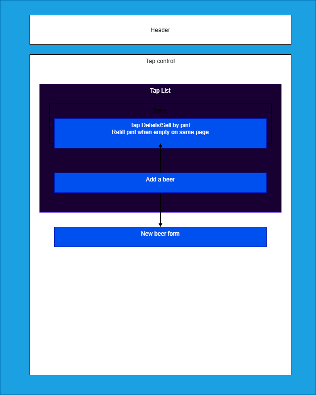

# Tap Room
### By Art Weinstein




### A basic webpage that allows users to add kegs, sell pints, view keg details and refill kegs.

## Technologies Used

* JavaScript
* HTML
* CSS
* React

## Description

This program allows the user to add a keg, view the keg details and sell pints through the details page. On the details page, the user will see the keg name, brand, alcohol content, price and amount of pints left. Pints are automatically initialized to 124, and once the pints run out, the user will be informed that the keg is out of stock. Users will be able to refill the keg on the same details page. On the adding keg form, users can only enter a name, brand, price and alcohol percentage. Since the keg is set to 124 pints by default, there is no option to add pints on the form. The user can navigate this basic page through several buttons that prompt the user to go back, add a keg, or refill a keg. To see the keg details, the user must click the "click here for details/orders on the keg page.
## Setup/Installation Requirements

1. [Clone](https://docs.github.com/en/github/creating-cloning-and-archiving-repositories/cloning-a-repository-from-github/cloning-a-repository) this repository.


2. Install the necessary dependencies:
- type ```npm install``` to install the necessary dependencies.
- type ```npm run start``` to preview the program.

3. Follow the prompts on the page to navigate the site (note, to view the keg details, you must click "click here for details/orders) towards the top of the page

## Known Bugs

* No bugs known at the moment, but UI improvements will be made.

## License

* [MIT License](https://opensource.org/licenses/MIT)

Copyright (c) 2021 Art Weinstein

## Contact Information

[Email](artur.weintsein@gmail.com)